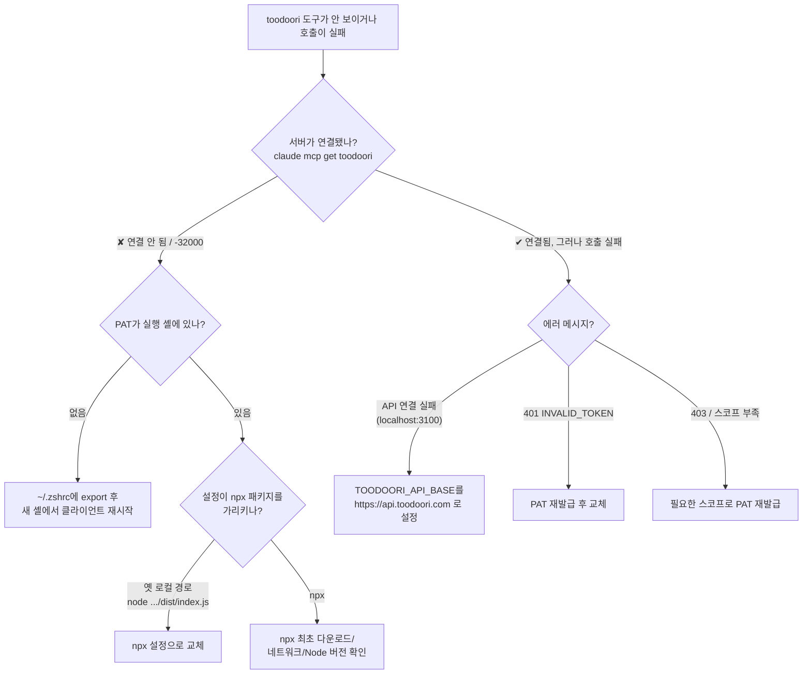

# toodoori MCP 등록·사용·문제 해결 가이드

toodoori MCP 서버(`@peoplenexteam/toodoori-mcp`)를 Claude Code / Claude Desktop에 연결할 때의 **등록 방법**, **정상 동작 확인**, **증상별 대응**을 한 곳에 모았습니다.

빠른 설치 요약은 [README](../README.md)를 보세요. 이 문서는 "안 될 때 어떻게 하나"에 집중합니다.

---

## 1. 사전 준비물

- **Node.js ≥ 20** (`npx` 사용) — `node -v`로 확인.
- **PAT(개인 액세스 토큰)** `tdr_pat_...` — toodoori.com 로그인 → 마이페이지 → 액세스 토큰 → 필요한 스코프만 골라 발급. **토큰은 발급 시 1회만 표시**되니 안전히 보관.
- **API 베이스 URL**: 운영은 반드시 `https://api.toodoori.com`. 미지정 시 로컬 개발용 `http://localhost:3100`으로 향해, 운영 사용자는 **모든 도구 호출이 실패**합니다.

---

## 2. 등록 방법

### 2-1. Claude Code (권장: 토큰을 셸 환경변수로)

토큰을 설정 파일에 평문으로 박지 말고, **셸 환경변수**로 두고 `${TOODOORI_PAT}`로 참조합니다. 이러면 `~/.claude.json`·트랜스크립트에 토큰이 남지 않습니다.

```bash
# 1) 셸 프로필(~/.zshrc 또는 ~/.bashrc)에 토큰을 export — 에디터로 직접 추가 권장
#    (echo로 추가하면 셸 히스토리에 토큰이 남습니다)
export TOODOORI_PAT="tdr_pat_...본인_토큰..."

# 2) 사용자 스코프로 등록 (모든 프로젝트에서 사용). add-json으로 ${VAR} 리터럴을 정확히 보존
claude mcp add-json --scope user toodoori '{"command":"npx","args":["-y","@peoplenexteam/toodoori-mcp"],"env":{"TOODOORI_PAT":"${TOODOORI_PAT}","TOODOORI_API_BASE":"https://api.toodoori.com"}}'
```

- `${TOODOORI_PAT}`는 **`claude`를 실행한 셸의 환경변수에서 실행 시점에 치환**됩니다. `TOODOORI_API_BASE`는 비밀이 아니므로 설정에 그대로 둡니다.
- **`claude mcp add`(--env) 대신 `add-json`을 쓰는 이유**: `claude mcp add --env KEY=${VAR}`는 추가 시점에 값을 확장해 평문으로 저장하는 동작이 있어, `${VAR}` 리터럴을 보존하려면 `add-json` 또는 설정 파일 직접 편집이 안전합니다.

> **대안(순수 상속 방식)**: 설정의 `env`를 비우고 셸에 `TOODOORI_PAT`과 `TOODOORI_API_BASE`를 **둘 다** export 한 뒤 `claude mcp add --scope user toodoori -- npx -y @peoplenexteam/toodoori-mcp`로 등록해도 됩니다(자식 프로세스가 셸 env를 상속). `${VAR}` 치환을 전혀 쓰지 않아 가장 단순합니다.

### 2-2. Claude Desktop

`claude_desktop_config.json`(`~/Library/Application Support/Claude/`)에 추가하고 `tdr_pat_...`만 본인 토큰으로 교체:

```jsonc
{
  "mcpServers": {
    "toodoori": {
      "command": "npx",
      "args": ["-y", "@peoplenexteam/toodoori-mcp"],
      "env": {
        "TOODOORI_PAT": "tdr_pat_...",
        "TOODOORI_API_BASE": "https://api.toodoori.com"
      }
    }
  }
}
```

- Desktop은 셸 환경변수 상속이 없으므로 **토큰을 이 파일에 직접** 넣습니다(평문 저장). 최소 권한·짧은 만료로 발급하고 유출 시 회전하세요.
- 이 파일은 홈 폴더에 있어 git에 올라가지 않습니다.

---

## 3. 정상 동작 확인 (검증)

- **Claude Code**:
  ```bash
  claude mcp get toodoori
  # 기대 출력: Status: ✔ Connected
  ```
  도구가 보이는지: 새 세션에서 `/mcp` → `toodoori`가 connected.
- **Claude Desktop**: 입력창의 도구(망치) 아이콘에 toodoori 도구 24개가 보이면 정상.
- **토큰만 단독 검증**(클라이언트와 무관하게 PAT가 유효한지):
  ```bash
  curl -s -o /dev/null -w "%{http_code}\n" \
    -H "Authorization: Bearer $TOODOORI_PAT" \
    https://api.toodoori.com/api/v1/projects
  # 200 = 정상,  401 = 토큰 무효/만료,  403 = 스코프 부족
  ```

> **"연결됨(connected)"이 곧 "인증 성공"은 아닙니다.** 서버 기동·도구 목록(`tools/list`)은 PAT 없이도/무효 PAT로도 뜰 수 있고, **PAT 인증은 실제 도구를 호출할 때** 검증됩니다. 그래서 도구 목록은 보이는데 호출만 실패하는 경우가 있습니다(→ 5-B 참고).

---

## 4. 진단 흐름도



---

## 5. 증상별 대응

### A. 서버가 아예 연결되지 않음

대표 증상: `Failed to reconnect to toodoori: -32000`, `/mcp`에서 reconnect 실패, 도구가 하나도 안 보임. 서버 로그(stderr)에 `[toodoori-mcp] fatal: ...`.

- **A-1. PAT가 없음** — stderr에 `[toodoori-mcp] fatal: TOODOORI_PAT 환경변수가 필요합니다.`
  - 원인: 설정 `env`가 비었거나, `${TOODOORI_PAT}`를 썼는데 **클라이언트를 실행한 셸에 변수가 없음**.
  - 해결(Claude Code): `~/.zshrc`에 `export TOODOORI_PAT="tdr_pat_..."` 추가 → **변수가 있는 새 셸에서 클라이언트를 재시작**. 확인: `echo ${TOODOORI_PAT:+set}`가 `set`이어야 함.
  - 해결(Desktop): `claude_desktop_config.json`의 `env.TOODOORI_PAT`에 토큰이 실제로 들어갔는지 확인.

- **A-2. PAT는 등록했는데 여전히 안 됨 — "이미 떠 있는 세션"이 변수를 모름**
  - `${TOODOORI_PAT}`는 **클라이언트 실행(launch) 시점**의 환경에서 읽힙니다. 이미 실행 중인 Claude Code/Desktop은 나중에 `~/.zshrc`에 추가한 변수를 모릅니다.
  - 해결: **완전히 종료 후, 변수가 export된 셸에서 다시 실행**.
    - Claude Code: 새 터미널 탭 열기(또는 `source ~/.zshrc`) → `claude`. 실행 중 세션에서 `/mcp` 재연결만 해도 그 프로세스 env엔 변수가 없어 또 실패합니다.
    - Desktop: `Cmd+Q`로 완전 종료 후 재실행(창만 닫으면 부족).

- **A-3. 설정이 존재하지 않는 로컬 경로를 가리킴**
  - 증상: 과거에 로컬 클론을 `node /path/to/mcp/dist/index.js`로 등록했는데 그 경로/디렉터리가 사라짐 → 파일 없음으로 즉시 크래시 → `-32000`.
  - 해결: 로컬 경로 대신 **npx 패키지**로 교체.
    ```bash
    claude mcp remove toodoori --scope local   # 깨진 프로젝트 로컬 설정 제거
    claude mcp remove toodoori --scope user     # 깨진 전역 설정 제거(있다면)
    # 그런 뒤 2-1로 재등록
    ```

- **A-4. npx 최초 실행 지연/네트워크**
  - 첫 실행 시 패키지를 내려받느라 핸드셰이크가 타임아웃될 수 있음. `npx -y @peoplenexteam/toodoori-mcp`를 터미널에서 한 번 직접 실행해 받아두고(곧바로 종료해도 됨) 재시도. 사내 프록시/레지스트리 차단 여부도 확인.

### B. 연결은 되는데 모든(또는 대부분) 도구 호출이 실패

- **B-1. `TOODOORI_API_BASE` 미설정 → 로컬로 향함**
  - 증상: 도구 호출 시 `API 연결 실패(http://localhost:3100): ... 서버가 떠 있는지(TOODOORI_API_BASE) 확인하세요.`
  - 원인: API 베이스 기본값이 로컬 개발용 `http://localhost:3100`인데 운영 서버를 안 띄움.
  - 해결: 설정 `env`에 `TOODOORI_API_BASE=https://api.toodoori.com` 추가 후 재시작.

- **B-2. 401 / `INVALID_TOKEN`**
  - 원인: PAT가 만료/폐기/회전됨, 오타, 또는 다른 환경의 토큰을 붙임.
  - 확인: 3절의 curl 테스트가 `401`이면 토큰 문제 확정.
  - 해결: PAT 재발급 → `~/.zshrc`(또는 Desktop 설정)의 토큰 교체 → 재시작.

- **B-3. 403 / 스코프 부족**
  - 원인: PAT에 해당 작업 스코프(예: 쓰기, 첨부)가 없음.
  - 해결: 필요한 스코프를 포함해 PAT 재발급.

### C. 특정 도구만 실패

- **4xx 검증 에러**: 에러 엔벨로프 `{ error, code, status }`의 `code`를 보고 입력을 교정합니다. **4xx는 재시도 금지**(같은 입력이면 또 실패).
- **ID 규약 위반**: `projectId`/`subProjectId`는 목록 도구의 `id`에서 받은 **인코딩 문자열 그대로** 사용(직접 파싱/생성 금지). `stageId`/`labelId`는 raw 정수. `taskNumber`는 프로젝트별 번호. 자세한 규약은 [README](../README.md) "규약" 참고.
- **첨부(`upload_task_attachment`) 실패**: 첨부 권한이 있는 사용자만 가능. `content`(텍스트/markdown) 또는 `filePath`(로컬 경로) 중 하나로 전달.

### D. 토큰이 노출됨 (보안 사고)

- 트랜스크립트·로그·`grep` 출력 등에 `tdr_pat_...`가 찍혔다면 **즉시 회전**: toodoori에서 해당 토큰 폐기 → 새 토큰 발급 → `~/.zshrc`/Desktop 설정 교체 → 재시작.
- 재발 방지: Claude Code에서는 토큰을 설정 파일에 박지 말고 **`${TOODOORI_PAT}` 환경변수 참조**(2-1)를 사용. 설정 파일을 `grep`/공유할 때 토큰이 평문으로 안 남습니다.

---

## 6. 진단 명령 모음

```bash
# 사용자 스코프 등록 상태 + 헬스체크 (Claude Code)
claude mcp get toodoori          # Status: ✔ Connected 기대
claude mcp list                  # 전체 MCP 서버 상태

# 실행 셸에 토큰이 있는지(값은 노출 안 함)
echo "PAT ${TOODOORI_PAT:+present, len=${#TOODOORI_PAT}}"

# 토큰 유효성만 직접 검증(클라이언트 무관)
curl -s -o /dev/null -w "%{http_code}\n" \
  -H "Authorization: Bearer $TOODOORI_PAT" \
  https://api.toodoori.com/api/v1/projects     # 200=정상 / 401=무효 / 403=스코프

# 서버를 단독 기동해 시작 에러 보기(Ctrl+C로 종료)
TOODOORI_PAT="$TOODOORI_PAT" TOODOORI_API_BASE="https://api.toodoori.com" \
  npx -y @peoplenexteam/toodoori-mcp
# PAT 없으면: [toodoori-mcp] fatal: TOODOORI_PAT 환경변수가 필요합니다.
# 정상이면:   [toodoori-mcp] connected · API=https://api.toodoori.com
```

---

## 7. 자주 묻는 질문

- **Q. `~/.zshrc`에 넣었는데 왜 아직 안 되나요?** → 이미 실행 중인 클라이언트는 모릅니다. 새 셸에서 **재시작**하세요(A-2).
- **Q. 토큰을 설정 파일에 직접 넣어도 되나요?** → Desktop은 그렇게 합니다(평문). Claude Code는 `${TOODOORI_PAT}` 참조를 권장합니다(유출 방지).
- **Q. 프로젝트마다 다른 토큰을 쓰고 싶어요.** → 프로젝트별로 다른 셸 환경변수를 export 하거나, 해당 프로젝트에서 `--scope local`로 별도 등록하세요. 단, 토큰을 `.mcp.json`(`--scope project`)에 넣어 커밋하지 마세요.
- **Q. 회사 PC에서 `npx`가 막혀요.** → 사내 npm 레지스트리/프록시 설정을 확인하거나, 패키지를 사전 설치(`npm i -g @peoplenexteam/toodoori-mcp`)한 뒤 `command`를 `toodoori-mcp`로 바꿔 등록하는 방법도 있습니다.

---

본 가이드의 버전 기준: `@peoplenexteam/toodoori-mcp` v0.2.0 · Node ≥ 20.
